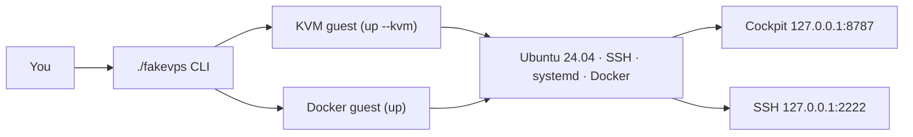
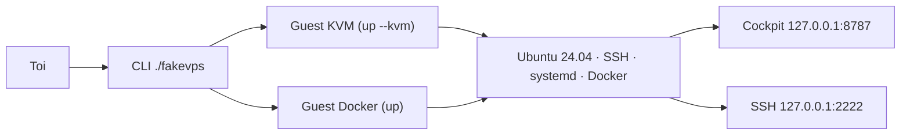

# FakeVPS

**Based on FakeVPS — https://github.com/Mr-Aurevo-X/FakeVPS**

Run a **local** Ubuntu node that behaves like a mid-range paid VPS — 6 GB RAM, 4 vCPU, 40 GB disk, SSH, systemd, Docker inside the guest — and rehearse a real deploy before renting a box. No bot is bundled: attach **any** Discord bot (Node, Python, Compose, Dockerfile).

[English](#english) · [Français](#français)

---

## English

### How it works

One CLI (`./fakevps`), two backends, same ports:

- `./fakevps up` — **privileged Docker** guest (`--fast`, the default). Faster iteration. Disk is the host Docker graph (an envelope, not a 40 GB partition). Near host-root — machine you control only.
- `./fakevps up --kvm` — **KVM/QEMU** guest. Strongest isolation, needs `/dev/kvm`.



Everything binds **127.0.0.1 only**: cockpit on `8787`, SSH on `2222`, optional bot panel on `BOT_PANEL_PORT`. Nothing listens on `0.0.0.0`.

### Linux

Requirements: Docker for the default backend, or QEMU/KVM (`/dev/kvm`) for `--kvm`.

```bash
cp config.env.example config.env
./fakevps up          # fast (privileged Docker, default)
# or
./fakevps up --kvm    # KVM guest
```

### Windows

FakeVPS runs inside **WSL2 + Ubuntu** (not in a VirtualBox/Hyper-V Linux VM).

1. Give WSL2 enough RAM (the node wants 6 GB) in `%UserProfile%\.wslconfig`.
2. Clone the repo inside the WSL filesystem and follow the Linux steps.
3. Default backend is already `./fakevps up` (`--fast`). Use `--kvm` only if `/dev/kvm` is available.
4. Optional helper from Windows: `contrib/fakevps.bat` (it still runs the Linux CLI inside WSL).

### Commands

| Command | What it does |
|---------|--------------|
| `./fakevps up [--fast|--kvm]` | Start the node and the cockpit (default: fast) |
| `./fakevps down [--wipe]` | Stop everything; `--wipe` erases all stored state |
| `./fakevps status [--json]` | Backend, SSH, cockpit, bot state |
| `./fakevps ssh [-- cmd]` | Shell into the guest |
| `./fakevps ui` | Open the cockpit |
| `./fakevps attach <dir>` | Point at a bot folder and deploy it |
| `./fakevps sync` | Re-rsync the bot tree |
| `./fakevps restart-bot` | Restart the bot in the guest (systemd or Compose) |
| `./fakevps panel` | Open the bot web UI if `BOT_PANEL_PORT` is set |
| `./fakevps metrics` | Guest telemetry JSON |
| `./fakevps reset` | Wipe disk/container; next `up` is a fresh node |
| `./fakevps snapshot list\|save\|restore\|rm <name>` | qcow2 snapshots of the node disk (kvm, node stopped) |
| `./fakevps doctor` | Check the host (KVM, Docker, RAM, disk, ports) before the first `up` |
| `./fakevps audit` | Check secrets permissions and git hygiene |
| `./fakevps -p <name> <cmd>` | Run with profile `profiles/<name>.env` (own state and ports) |
| `./fakevps install-service [--fast\|--kvm]` | systemd user unit for auto-start |

### Attach a bot

```bash
cp secrets/discord.env.example secrets/discord.env
# set DISCORD_TOKEN=… (never commit this file)

./fakevps attach ~/MyBot
```

Or click **Parcourir** in the cockpit's Bot tile and pick the folder — no path typing, no quoting issues.

- **`.env` injection** — attach copies `BOT_DIR/.env` if present, then overlays non-empty keys from `secrets/discord.env`. The guest file is `/home/ubuntu/app/.env` (mode `600`). The cockpit only ever shows token **present/absent**, never the value. If a required key is missing (`DATABASE_URL`, Compose variables…), the deploy stops early with the exact list. On `--fast`, loopback URLs (`localhost` / `127.0.0.1`) are rewritten to the host compose service that publishes that port, and the node joins that Docker network. The host `.env` is not modified.
- **Runtime detection** (first match wins): `fakevps.bot.yml` → Compose → Dockerfile → Node → Python. Copy [examples/fakevps.bot.yml](examples/fakevps.bot.yml) into the bot repo to override.

```yaml
runtime: compose          # or node | docker | python | auto
compose_file: docker-compose.yml
fallback: none            # node = allow compose then Node (opt-in)
start: npm start
panel:
  start: npm run panel   # optional; needs BOT_PANEL_PORT
```

  A compose file that fails (or has no `bot`/`worker`/`discord` container) does **not** start Node unless `fallback: node` (or `runtime: node`) is set.
- **Monorepos** — the root `build:ci` / `build` script is used so workspace packages compile in order. If the build fails, no service is installed and `attach` reports the failure.
- Set `BOT_PANEL_PORT=3000` in `config.env` to forward the bot's own web UI on `http://127.0.0.1:3000`. The guest process starts only if `fakevps.bot.yml` also has `panel.start` (otherwise the forward stays idle).

### Cockpit

`./fakevps ui` or [http://127.0.0.1:8787](http://127.0.0.1:8787).

- Power controls, node envelope, live telemetry (guest only — never the host PC)
- SSH command with copy / open-terminal buttons
- Health LEDs (SSH, Docker, Bot, Cockpit, guest containers)
- Bot tile: Browse, attach, sync, restart
- Journal plus a diagnostic dialog with copy-able fixes

### Configuration (`config.env`)

| Key | Default | Meaning |
|-----|---------|---------|
| `BACKEND` | `fast` | `fast` (default, privileged Docker) or `kvm` |
| `RAM_MB` / `CPUS` / `DISK_GB` | `6144` / `4` / `40` | Node envelope |
| `SSH_PORT` / `UI_PORT` | `2222` / `8787` | Host ports (loopback) |
| `BOT_DIR` | empty | Attached bot folder (set by `attach`) |
| `BOT_RUNTIME` | `auto` | Force `compose`/`docker`/`node`/`python` |
| `BOT_PANEL_PORT` | empty | Forward the bot's web UI (`panel.start` starts the process) |
| `EPHEMERAL` | `false` | `true` = every `down` erases all stored state |

**Ephemeral mode** — with `EPHEMERAL=true` (or `./fakevps down --wipe`), shutdown deletes the guest disk (bot code and injected `.env` included), the fast Docker graph, logs and caches. Only `secrets/` and the host SSH key remain. The next `up` re-provisions from scratch.

### Security & privacy

- Everything binds `127.0.0.1`. The cockpit refuses non-loopback hosts and cross-site POSTs.
- The author collects **nothing**: no analytics, no phone-home, no external fonts. Tokens stay on your machine.
- `--fast` is the **default** and runs a **privileged** container — near host-root. Prefer `./fakevps up --kvm` when isolation matters.
- Never commit `secrets/discord.env`, `config.env`, or `state/`. The public artifact is the git repository, not a zip of the working folder.

Details: [SECURITY.md](SECURITY.md).

### License

Custom terms — see [LICENSE](LICENSE). **Allowed:** use, copy, modify, run, including commercial projects. **Required:** keep the credit and the origin line `Based on FakeVPS — https://github.com/Mr-Aurevo-X/FakeVPS` in the cockpit footer, the CLI help and the README. **Forbidden:** stripping the credit or presenting FakeVPS as your own. Copyright (c) 2026 **Mr-Aurevo-X**.

---

## Français

### Fonctionnement

Une CLI (`./fakevps`), deux moteurs, mêmes ports :

- `./fakevps up` — guest **Docker privilégié** (`--fast`, le défaut). Plus rapide. Le disque est le graph Docker sur l’hôte (enveloppe, pas une partition 40 Go). Quasi root hôte — machine à toi uniquement.
- `./fakevps up --kvm` — guest **KVM/QEMU**. Isolation maximale, nécessite `/dev/kvm`.



Tout écoute en **127.0.0.1 uniquement** : cockpit sur `8787`, SSH sur `2222`, panneau du bot optionnel sur `BOT_PANEL_PORT`. Rien sur `0.0.0.0`.

### Linux

Prérequis : Docker pour le moteur par défaut, ou QEMU/KVM (`/dev/kvm`) pour `--kvm`.

```bash
cp config.env.example config.env
./fakevps up          # fast (Docker privilégié, défaut)
# ou
./fakevps up --kvm    # guest KVM
```

### Windows

FakeVPS tourne dans **WSL2 + Ubuntu** (pas dans une VM Linux VirtualBox/Hyper-V).

1. Donne assez de RAM à WSL2 (le nœud veut 6 Go) dans `%UserProfile%\.wslconfig`.
2. Clone le dépôt dans le système de fichiers WSL et suis les étapes Linux.
3. Le défaut est déjà `./fakevps up` (`--fast`). `--kvm` seulement si `/dev/kvm` est disponible.
4. Aide optionnelle côté Windows : `contrib/fakevps.bat` (lance la CLI Linux dans WSL).

### Commandes

| Commande | Rôle |
|----------|------|
| `./fakevps up [--fast|--kvm]` | Démarrer le nœud et le cockpit (défaut : fast) |
| `./fakevps down [--wipe]` | Tout arrêter ; `--wipe` efface tout l'état stocké |
| `./fakevps status [--json]` | Moteur, SSH, cockpit, état du bot |
| `./fakevps ssh [-- cmd]` | Shell dans le guest |
| `./fakevps ui` | Ouvrir le cockpit |
| `./fakevps attach <dossier>` | Attacher un dossier de bot et le déployer |
| `./fakevps sync` | Re-rsync de l'arbre du bot |
| `./fakevps restart-bot` | Relancer le bot dans le guest (systemd ou Compose) |
| `./fakevps panel` | Ouvrir l'UI web du bot si `BOT_PANEL_PORT` est défini |
| `./fakevps metrics` | Télémétrie du guest en JSON |
| `./fakevps reset` | Effacer disque/conteneur ; le prochain `up` repart de zéro |
| `./fakevps snapshot list\|save\|restore\|rm <nom>` | Snapshots qcow2 du disque du nœud (kvm, nœud arrêté) |
| `./fakevps doctor` | Vérifier l'hôte (KVM, Docker, RAM, disque, ports) avant le premier `up` |
| `./fakevps audit` | Vérifier permissions des secrets et hygiène git |
| `./fakevps -p <nom> <cmd>` | Lancer avec le profil `profiles/<nom>.env` (état et ports séparés) |
| `./fakevps install-service [--fast\|--kvm]` | Unité systemd utilisateur (auto-démarrage) |

### Attacher un bot

```bash
cp secrets/discord.env.example secrets/discord.env
# DISCORD_TOKEN=… (ne jamais commiter ce fichier)

./fakevps attach ~/MonBot
```

Ou clique **Parcourir** dans la tuile Bot du cockpit et choisis le dossier — pas de chemin à taper, pas de souci d'espaces.

- **Injection `.env`** — `attach` copie `BOT_DIR/.env` s'il existe, puis surcharge avec les clés non vides de `secrets/discord.env`. Côté guest : `/home/ubuntu/app/.env` (mode `600`). Le cockpit affiche seulement jeton **présent/absent**, jamais la valeur. S'il manque une clé requise (`DATABASE_URL`, variables Compose…), le déploiement s'arrête tôt avec la liste exacte. En `--fast`, les URL en loopback (`localhost` / `127.0.0.1`) sont réécrites vers le service compose hôte qui publie ce port, et le nœud rejoint ce réseau Docker. Le `.env` hôte n'est pas modifié.
- **Détection du runtime** (premier match gagnant) : `fakevps.bot.yml` → Compose → Dockerfile → Node → Python. Copie [examples/fakevps.bot.yml](examples/fakevps.bot.yml) dans le repo du bot pour forcer.

```yaml
runtime: compose          # ou node | docker | python | auto
compose_file: docker-compose.yml
fallback: none            # node = autoriser compose puis Node (opt-in)
start: npm start
panel:
  start: npm run panel   # optionnel ; nécessite BOT_PANEL_PORT
```

  Un Compose qui échoue (ou sans conteneur `bot`/`worker`/`discord`) **ne lance pas** Node, sauf `fallback: node` (ou `runtime: node`).
- **Monorepos** — le script racine `build:ci` / `build` compile les packages workspace dans l'ordre. Si le build échoue, aucun service n'est installé et `attach` remonte l'échec.
- Mets `BOT_PANEL_PORT=3000` dans `config.env` pour forwarder l'UI web du bot sur `http://127.0.0.1:3000`. Le process guest ne part que si `fakevps.bot.yml` a aussi `panel.start` (sinon le forward reste vide).

### Cockpit

`./fakevps ui` ou [http://127.0.0.1:8787](http://127.0.0.1:8787).

- Alimentation, enveloppe du nœud, télémétrie en direct (guest uniquement — jamais le PC hôte)
- Commande SSH avec boutons copier / ouvrir un terminal
- LEDs de santé (SSH, Docker, Bot, Cockpit, conteneurs du guest)
- Tuile Bot : parcourir, attacher, synchroniser, relancer
- Journal et fenêtre de diagnostic avec correctifs copiables

### Configuration (`config.env`)

| Clé | Défaut | Rôle |
|-----|--------|------|
| `BACKEND` | `fast` | `fast` (défaut, Docker privilégié) ou `kvm` |
| `RAM_MB` / `CPUS` / `DISK_GB` | `6144` / `4` / `40` | Enveloppe du nœud |
| `SSH_PORT` / `UI_PORT` | `2222` / `8787` | Ports hôte (loopback) |
| `BOT_DIR` | vide | Dossier du bot attaché (rempli par `attach`) |
| `BOT_RUNTIME` | `auto` | Forcer `compose`/`docker`/`node`/`python` |
| `BOT_PANEL_PORT` | vide | Exposer l'UI web du bot (`panel.start` lance le process) |
| `EPHEMERAL` | `false` | `true` = chaque `down` efface tout l'état stocké |

**Mode éphémère** — avec `EPHEMERAL=true` (ou `./fakevps down --wipe`), l'extinction supprime le disque du guest (code du bot et `.env` injecté compris), le graph Docker du mode fast, les journaux et les caches. Seuls `secrets/` et la clé SSH de l'hôte restent. Le prochain `up` re-provisionne tout.

### Sécurité et vie privée

- Tout écoute sur `127.0.0.1`. Le cockpit refuse les hôtes non-loopback et les POST cross-site.
- L'auteur **ne collecte rien** : pas d'analytics, pas d'appel réseau caché, pas de polices externes. Les jetons restent sur ta machine.
- `--fast` est le **défaut** et lance un conteneur **privilégié** — quasi root sur l'hôte. Préfère `./fakevps up --kvm` quand l'isolation compte.
- Ne commite jamais `secrets/discord.env`, `config.env` ni `state/`. L'artefact public est le dépôt git, pas un zip du dossier de travail.

Détails : [SECURITY.md](SECURITY.md).

### Licence

Termes personnalisés — voir [LICENSE](LICENSE). **Autorisé :** utiliser, copier, modifier, exécuter, y compris en commercial. **Obligatoire :** garder le crédit et la ligne d'origine `Based on FakeVPS — https://github.com/Mr-Aurevo-X/FakeVPS` dans le pied du cockpit, l'aide CLI et le README. **Interdit :** retirer le crédit ou présenter FakeVPS comme ton produit. Copyright (c) 2026 **Mr-Aurevo-X**.
